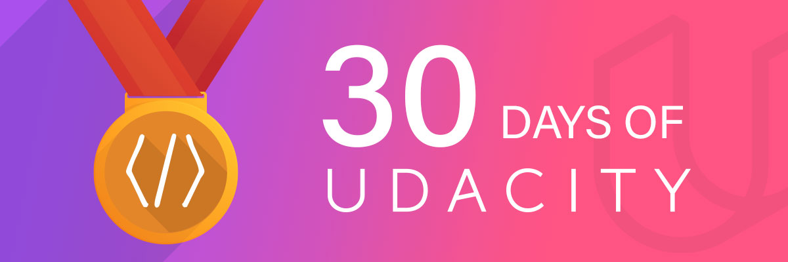

# 30 Days of code Udacity Intel AI Scholarship

Got my name mentined with star at https://sites.google.com/udacity.com/intel-edge-ai-scholarship/community/30-days-of-udacity/honorable-mentions-wall

## DAY 1 
Solved some SQL problem statements from hackkerrank 

## DAY 2

Completed Quicklabs of GCP essentials Quest

## DAY 3

Completed one lab of BIGQUERY on GCP

## DAY 4
Completed Lesson 4 of Intel Edge AI foundational course & co-hosted the @sg_mumbai virtual meetup

## DAY 5
Solved few python problems in codesignal ,based on problem solving

## Day 6
solved all SQL problems of basic track of hackkerank

## Day 7
Wrote my own Kmeans function

## Day 8
Made progress in Lesson 5 of Intel Edge AI foundational course & started learning GO from coursera

## Day 9
Completed 50% of BigQuery For Data Analysis path in GCP and 50% of Cloud Engineering  of GCP

## Day 10
Earned GCP badges for GCP essesntials and BigQuery For Data Analysis quests

## Day 11
Completed Cloud Engineering path in GCP and earned a qwiklabs badge in Cloud Engineering

## Day 12
Completed the foundational course of Intel Edge AI scholarship

## Day 13
Completed week 2 of Go programming course in coursera

## Day 14
Made submission on https://www.kaggle.com/c/udacity-mlcharity-competition and got 64th Rank in leaderboard in 1st attempt

## Day 15
Made progress in week 3 of Golang course in Coursera

## Day 16
completed assigment of week 3 of Golang course in Coursera

## Day 17
Practised some Python coding in codesignal

## Day 18
Completed assignment 1 of week 4

## Day 19
Completed assignment 2 of week 4

## Day 20
Started with Functions, Methods, and Interfaces in Go course in coursera

## Day 21
Completed labs on qwicklabs for buidling skills on AWS 

Introduction to Amazon EC2

Introduction to Amazon Relational Database Service (RDS) - SQL Server

Introduction to Elastic Load Balancing

Introduction to Amazon Relational Database Service (RDS) (Windows)

Creating a Serverless Video Conversion Watchfolder Workflow for MediaConvert

Building a Live Video Channel with MediaLive, MediaStore and CloudFront

Build a Dynamic Conversational Bot - Part 1

Build a Dynamic Conversational Bot - Part 2

## Day 22
Completed labs on qwicklabs for buidling skills on AWS 

Using Open Data with Amazon S3.

Working with Alexa: Build a How-To Skill. 

Building a Live Video Channel with MediaLive, MediaStore and CloudFront

Creating a Serverless Video Conversion Watchfolder Workflow for MediaConvert

## Day 23
Learned some optimized clustering techniques

## Day 24
Finished viewing Functions, Methods, and Interfaces in Go videos for week 1

## Day 25
Revision of lesson 2 of fundamental course of intel

## Day 26
Revision of lesson 3 of fundamental course of intel

## Day 27
Revision of lesson 4 of fundamental course of intel

## Day 28
Revision of lesson 5 of fundamental course of intel

## Day 29
Practised (solved) some python problem statement from codesignal

## Day 30

Started with opencv basics form pyimage search

